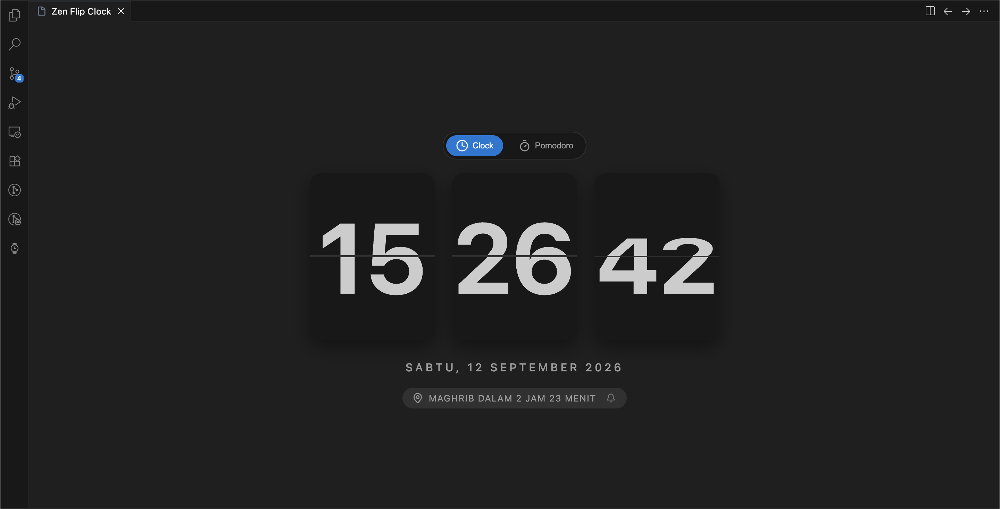
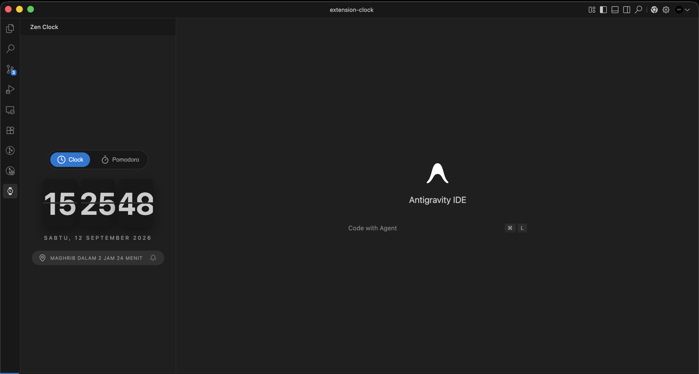
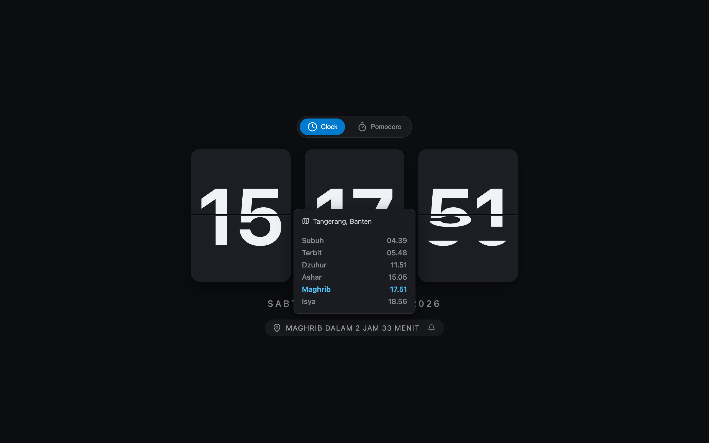
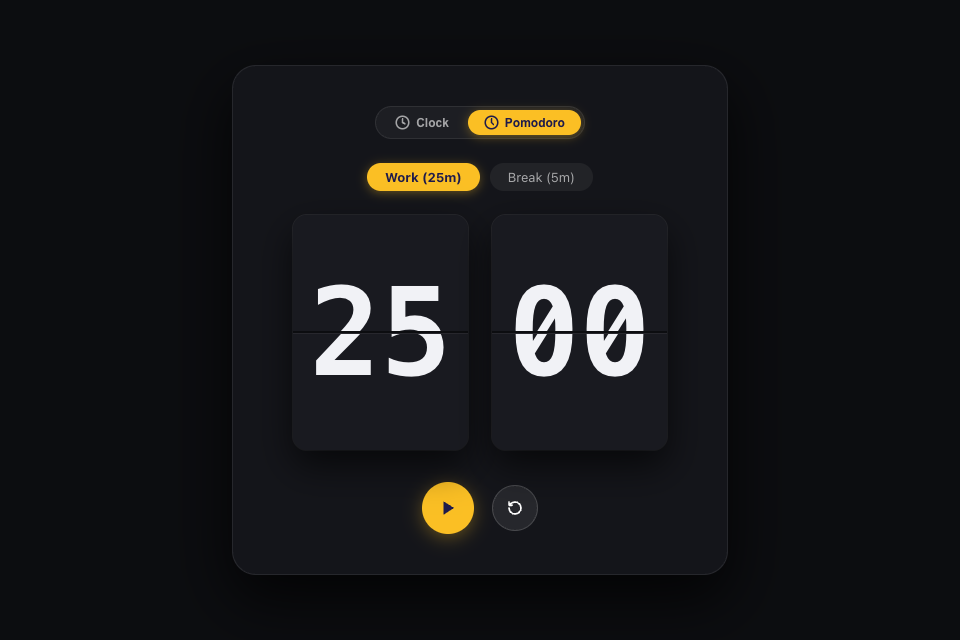

# ⏰ Zen Flip Clock, Prayer Times & Pomodoro

<p align="center">
  
</p>

<p align="center">
  <b>Aplikasi Jam Flip 3D Minimalis, Jadwal Sholat Otomatis, & Pomodoro Timer</b><br />
  Tersedia sebagai <b>Progressive Web App (PWA)</b> mandiri dan <b>VS Code / Antigravity IDE Extension</b>.
</p>

<p align="center">
  
  
  
  
  
</p>

---

## 📸 Galeri Antarmuka (Live Screenshots)

### 🔌 1. Mode Ekstensi (VS Code & Antigravity IDE)

| Sidebar View (Panel Samping) | Full Editor Panel Tab |
| :---: | :---: |
|  |  |

### 🌐 2. Mode Web Standalone & Progressive Web App (PWA)

| Jadwal Sholat & Popover | Pomodoro Timer |
| :---: | :---: |
|  |  |

---

## 🌟 Fitur Utama

- **🕰️ 3D Zen Flip Clock**: Jam mekanik bergaya flip clock retro-modern dengan kartu animasi 3D yang halus dan responsif.
- **🕌 Jadwal Sholat Otomatis**:
  - Perhitungan waktu sholat presisi menggunakan pustaka astronomi [`adhan`](https://github.com/batoulapps/adhan-js).
  - Deteksi lokasi otomatis via browser Geolocation dengan fallback cerdas IP Reverse Lookup & OpenStreetMap.
  - Hover popover interaktif untuk melihat daftar lengkap jadwal waktu sholat harian (Subuh, Terbit, Dzuhur, Ashar, Maghrib, Isya).
- **🍅 Pomodoro Timer**:
  - Timer kerja (Work 25m) dan istirahat (Break 5m) dengan tampilan angka flip.
  - Kontrol play/pause/reset interaktif.
  - Judul tab browser dinamis yang menampilkan sisa waktu timer: `(24:59) Work - Zen Clock`.
- **📱 Progressive Web App (PWA) & Offline Mode**:
  - Dapat di-install langsung di Desktop (Chrome, Edge, macOS/Windows) dan Smartphone (Android & iOS).
  - Service Worker cerdas untuk caching aset statis dan akses offline secara instan.
  - Tombol **Install** interaktif di bar navigasi.
- **🔔 Universal Notification & Audio Chime**:
  - Notifikasi native jendela di VS Code extension.
  - Web Browser Notification saat waktu sholat atau sesi Pomodoro berakhir.
  - Suara audio chime lembut saat alarm berbunyi.

---

## 🚀 1. Menjalankan Versi Web & PWA

### Menjalankan di Mode Development
```bash
npm run dev
```
Buka browser di `http://localhost:5173`.

### Membangun untuk Produksi (Web)
```bash
npm run build:web
```
Hasil build web siap pakai akan berada di direktori `dist/`.

### Menjalankan Preview Hasil Build
```bash
npm run preview
```

### 📲 Cara Install Aplikasi (PWA)
- **Desktop (Chrome / Edge / Brave)**: Klik tombol **Install** di navigasi aplikasi atau klik ikon install di address bar browser.
- **Android**: Buka website di Chrome $\rightarrow$ Klik tombol **Install** atau pilih menu *Add to Home Screen*.
- **iOS / iPadOS (Safari)**: Buka website di Safari $\rightarrow$ Tekan tombol **Share (Bagikan)** $\rightarrow$ Pilih ***Add to Home Screen (Tambah ke Layar Utama)***.

---

## 🌐 Panduan Deployment Web

### Opsi 1: Vercel (Rekomendasi)
1. Hubungkan repository GitHub ini di [Vercel Dashboard](https://vercel.com).
2. Atau jalankan via Vercel CLI:
   ```bash
   npx vercel --prod
   ```

### Opsi 2: Netlify
1. Build aplikasi:
   ```bash
   npm run build:web
   ```
2. Upload folder `dist/` ke [Netlify Drop](https://app.netlify.com/drop), atau deploy via Netlify CLI:
   ```bash
   npx netlify deploy --prod --dir=dist
   ```

### Opsi 3: GitHub Pages
1. Install dependency deploy:
   ```bash
   npm install -D gh-pages
   ```
2. Tambahkan script pada `package.json`:
   ```json
   "deploy": "npm run build:web && gh-pages -d dist"
   ```
3. Jalankan:
   ```bash
   npm run deploy
   ```

---

## 🔌 2. Menjalankan Versi VS Code / Antigravity IDE Extension

### Mode Debugging Lokal (F5)
1. Buka workspace di VS Code atau Antigravity IDE.
2. Tekan `F5` atau buka panel **Run and Debug** $\rightarrow$ Pilih **Extension**.
3. Buka ikon **Zen Clock** di Activity Bar sebelah kiri.

### Memaketkan Extension (.vsix)
```bash
npm run package:vsix
```
Install file `.vsix` yang dihasilkan melalui menu Extensions (`...` $\rightarrow$ `Install from VSIX...`).

---

## 🛠️ Tech Stack

- **Frontend Core**: React 19, JavaScript (ESNext)
- **Bundler & Tooling**: Vite 8, TypeScript
- **PWA**: Service Worker Cache API, Web App Manifest
- **Prayer Calculation**: Adhan JS
- **Icons**: Lucide React
- **Extension API**: VS Code Webview API

---

## 📄 Lisensi

Didistribusikan di bawah lisensi MIT.
