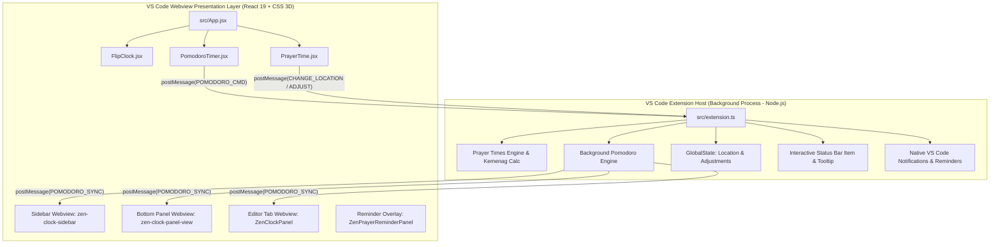

# Arsitektur Zen Clock: VS Code Extension First

Dokumen ini menjelaskan arsitektur teknis dari ekstensi **Zen Flip Clock & Prayer Times** untuk Visual Studio Code dan Antigravity IDE.

---

## 🏛️ Prinsip Desain: Extension-Host First

Ekstensi ini dibangun dengan prinsip bahwa **Extension Host (Node.js)** adalah **Single Source of Truth** untuk seluruh state aplikasi, logika bisnis, dan proses latar belakang. Webview (React) berfungsi murni sebagai **Presentation Layer (View)** yang dapat dibuka, ditutup, atau di-*hibernate* oleh VS Code kapan saja tanpa merusak state sistem.

---

## 🧩 Komponen Utama

### 1. Extension Host (`src/extension.ts`)
- **Background Pomodoro Timer**:
  - Mengelola countdown satu-satunya (*single active state*).
  - Menyimpan `timeLeft`, `isRunning`, `mode` ('work' | 'break'), dan `targetEndTime`.
  - Memicu event broadcast ke semua webview aktif (`activeWebviews`).
  - Memperbarui status bar per detik dengan icon dan sisa waktu.
  - Memunculkan notifikasi OS saat sesi selesai.

- **Status Bar Manager**:
  - Menampilkan jam saat ini atau countdown Pomodoro di bilah status bawah VS Code.
  - Menampilkan tooltip Markdown interaktif dengan countdown waktu sholat terdekat (detik presisi) dan tabel seluruh jadwal sholat hari ini.
  - Menyediakan *quick links* untuk membuka panel dan mengganti kota.

- **Prayer Times Engine (`src/utils/prayerHelper.js`)**:
  - Mengkalkulasi waktu sholat menggunakan Adhan.js dengan parameter resmi Kemenag RI (Subuh 20°, Isya 18°, Syafi'i, +2 menit ihtiyat).
  - Mendukung penyesuaian manual (*custom prayer adjustments*).

- **ZenPrayerReminderPanel**:
  - Webview tab khusus pengingat sholat yang otomatis muncul (*auto-open*) atau melalui notifikasi ketika waktu sholat tiba.

---

### 2. Presentation Layer Webview (`src/components/`)
- **`FlipClock.jsx` & `FlipUnit.jsx`**:
  - Menampilkan jam bergaya 3D flip card retro dengan animasi transisi angka halus.
- **`PomodoroTimer.jsx`**:
  - UI flip card untuk Pomodoro yang disinkronkan dengan Extension Host.
  - Mengirim perintah kontrol (`START`, `PAUSE`, `RESET`, `SWITCH_MODE`) ke Extension Host.
- **`PrayerTime.jsx`**:
  - Menampilkan hitung mundur waktu sholat terdekat, nama kota aktif, dan tabel jadwal lengkap.
  - Membuka QuickPick ganti kota atau modal penyesuaian waktu sholat.

---

## 🔄 Protokol Komunikasi (IPC: PostMessage)

| Arah | Tipe Pesan (`type`) | Payload | Deskripsi |
| :--- | :--- | :--- | :--- |
| Webview ➔ Host | `POMODORO_CMD` | `{ action: 'start' \| 'pause' \| 'reset' \| 'switchMode', mode? }` | Perintah kontrol timer Pomodoro |
| Host ➔ Webviews | `POMODORO_SYNC` | `{ isRunning, mode, timeLeft, totalTime }` | Sinkronisasi state Pomodoro ke seluruh UI |
| Webview ➔ Host | `REQUEST_CHANGE_LOCATION` | - | Meminta Host membuka QuickPick ganti lokasi kota |
| Host ➔ Webviews | `LOCATION_UPDATED` | `{ name, lat, lng }` | Memperbarui koordinat kota aktif |
| Webview ➔ Host | `SAVE_PRAYER_ADJUSTMENTS`| `{ fajr, dhuhr, asr, maghrib, isha }` | Menyimpan offset menit sholat ke konfigurasi |
| Host ➔ Webviews | `PRAYER_ADJUSTMENTS_SYNC`| `{ adjustments }` | Sinkronisasi offset waktu sholat |

---

## 🚀 Alur Build & Packaging

1. **Kompilasi Extension Host**:
   `esbuild src/extension.ts --bundle --outfile=out/extension.js --external:vscode --format=cjs --platform=node`
2. **Kompilasi Webview React**:
   `vite build` (menghasilkan aset statis di `dist/`)
3. **Packaging VSIX**:
   `npx @vscode/vsce package` (membungkus `out/`, `dist/`, `package.json`, dan icon menjadi file `.vsix`)
